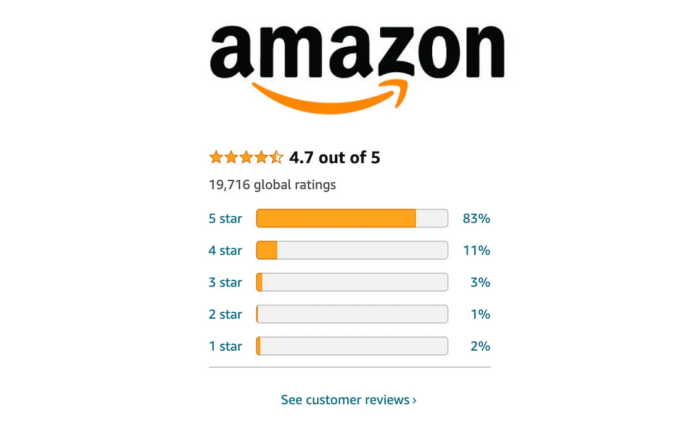

# Amazon-Review-Sentiment-Analysis-Project

 

## Business Problem

**Kozmos**, which produces products focused on home textiles and daily wear and sells through Amazon, aims to increase its sales by analyzing the comments on its products and improving its features according to the complaints it receives. In line with this goal, the comments will be labeled by sentiment analysis and a classification model will be created with the labeled data.

## Dataset Story

The data set consists of variables indicating the comments made on a particular product group, the comment title, the number of stars, and how many people found the comment useful.

## Features of Dataset

- **Total Features :** 4
- **Total Row :** 5611
- **CSV File Size :** 477 KB

## Variable Descriptions

**Star:** Number of stars given to the product

**Helpful:** Number of people who found the review helpful

**Title:** Title given to the comment content, short comment

**Review:** Comment on the product
